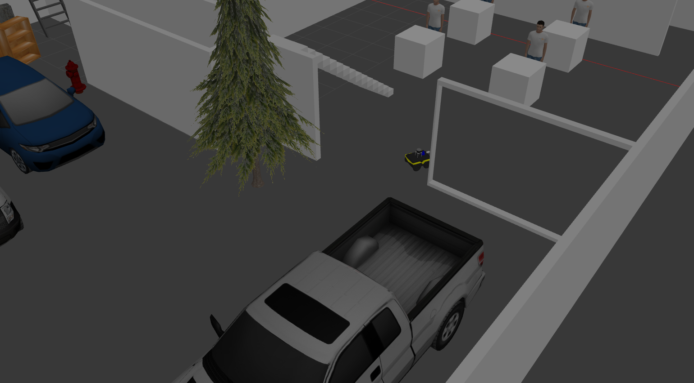
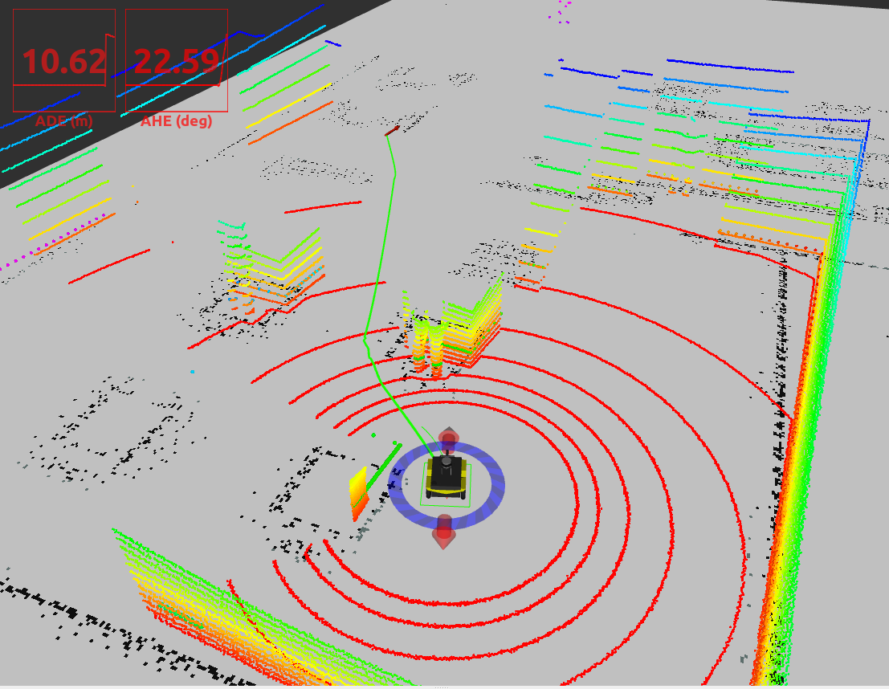
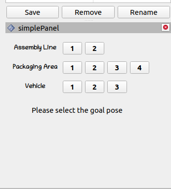

# ME5413_Final_Project_Group_21

NUS ME5413 Autonomous Mobile Robotics Final Project - Group 21




## Dependencies

* System Requirements:
  * Ubuntu 20.04 (18.04 not yet tested)
  * ROS Noetic (Melodic not yet tested)
  * C++11 and above
  * CMake: 3.0.2 and above
* This repo depends on the following standard ROS pkgs:
  * `roscpp`
  * `rospy`
  * `rviz`
  * `std_msgs`
  * `nav_msgs`
  * `geometry_msgs`
  * `visualization_msgs`
  * `tf2`
  * `tf2_ros`
  * `tf2_geometry_msgs`
  * `pluginlib`
  * `map_server`
  * `gazebo_ros`
  * `jsk_rviz_plugins`
  * `jackal_gazebo`
  * `jackal_navigation`
  * `velodyne_simulator`
  * `teleop_twist_keyboard`
* And this [gazebo_model](https://github.com/osrf/gazebo_models) repositiory

## Installation

This repo is a ros workspace, containing three rospkgs:

* `interactive_tools` are customized tools to interact with gazebo and your robot
* `jackal_description` contains the modified jackal robot model descriptions
* `me5413_world` the main pkg containing the gazebo world, and the launch files
* `costmap_prohibition_layer` the main pkg containing the function to create prohibited areas
* `robot_nav` the main pkg containing the navigation stack


To install this package, follow the following steps

```bash
# Clone your own fork of this repo (assuming home here `~/`)
cd
git clone https://github.com/Jimmy291/ME5413_Final_Project.git
cd ME5413_Final_Project/src


# Clone the repo for costmap prohibition layer
git clone git@github.com:rst-tu-dortmund/costmap_prohibition_layer.git
cd ..

# Install all dependencies
rosdep install --from-paths src --ignore-src -r -y

# Build
catkin_make
# Source 
source devel/setup.bash
```

To properly load the gazebo world, you will need to have the necessary model files in the `~/.gazebo/models/` directory.

There are two sources of models needed:

* [Gazebo official models](https://github.com/osrf/gazebo_models)
  
  ```bash
  # Create the destination directory
  cd
  mkdir -p .gazebo/models

  # Clone the official gazebo models repo (assuming home here `~/`)
  git clone https://github.com/osrf/gazebo_models.git

  # Copy the models into the `~/.gazebo/models` directory
  cp -r ~/gazebo_models/* ~/.gazebo/models
  ```

* [The customized models](https://github.com/NUS-Advanced-Robotics-Centre/ME5413_Final_Project/tree/main/src/me5413_world/models)

  ```bash
  # Copy the customized models into the `~/.gazebo/models` directory
  cp -r ~/ME5413_Final_Project/src/me5413_world/models/* ~/.gazebo/models
  ```

## Usage

### 0. Gazebo World

This command will launch the gazebo with the project world

```bash
# Launch Gazebo World together with our robot
roslaunch me5413_world world.launch
```
### 1. Mapping

After launching **Step 0**, in the second terminal:

```bash
# Launch GMapping
roslaunch me5413_world mapping.launch
```

After finishing mapping, run the following command in the thrid terminal to save the map:

```bash
# Save the map as `my_map` in the `maps/` folder
roscd me5413_world/maps/
rosrun map_server map_saver -f my_map map:=/map
```


### 2. Robot navigation

### 2.1. Manual Control

If you wish to explore the gazebo world a bit, we provide you a way to manually control the robot around:

```bash
# Only launch the robot keyboard teleop control
roslaunch me5413_world manual.launch
```

**Note:** This robot keyboard teleop control is also included in all other launch files, so you don't need to launch this when you do mapping or navigation.


### 2.2. Autonomous Navigation



Once completed **Step 1** mapping and saved your map, quit the mapping process.

Then, in the second terminal:

```bash
# Load the map and launch the navigation stack
roslaunch robot_nav nav.launch
```

The right panel allow you to choose the desired goal location of the robot.




The [ME5413_Final_Project](https://github.com/Jimmy291/ME5413_Final_Project) is released under the [MIT License](https://github.com/Jimmy291/ME5413_Final_Project/blob/main/LICENSE)
